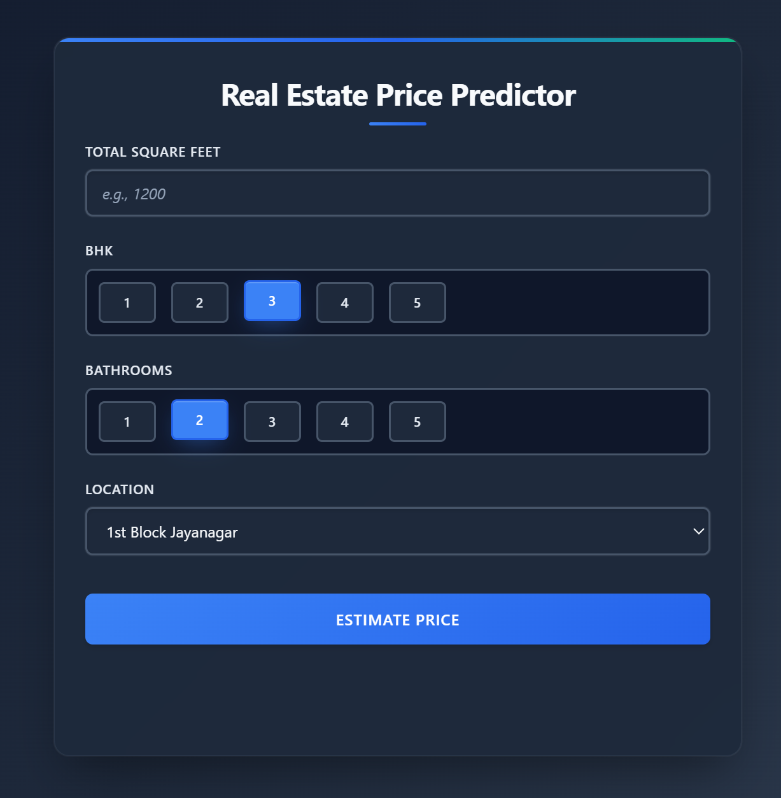
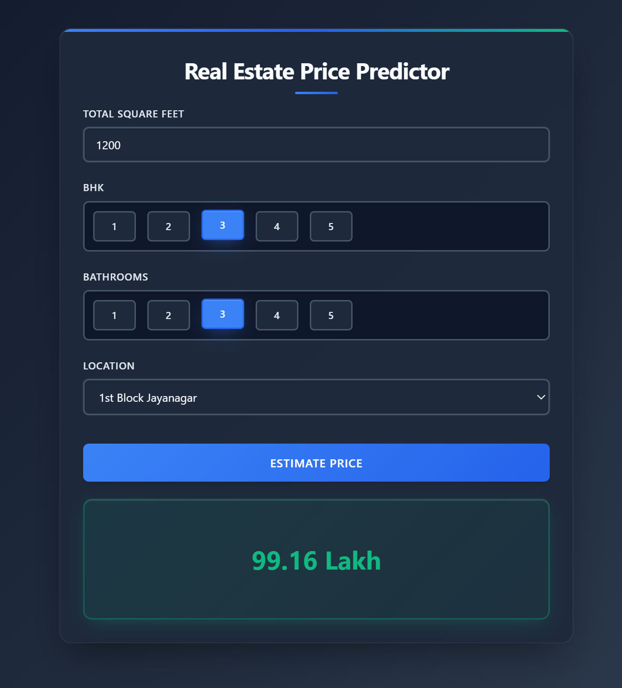

# Real Estate Price Prediction

This is a web application designed to predict real estate prices in Bengaluru, India. The prediction is based on key features such as location, total square feet, the number of bedrooms (BHK), and the number of bathrooms.

The project consists of a Python Flask server that serves a machine learning model and a client-side web interface for users to interact with.

## Features

-   A clean and simple user interface for entering property details.
-   Dynamic loading of property locations from the backend server.
-   Real-time price estimation using a pre-trained machine learning model.
-   Easy-to-use controls for selecting BHK and bathroom counts.

## Screenshots

Here are a few screenshots of the application in action.

**Main Interface:**


**Price Estimation Result:**



## Tech Stack

### Frontend
-   HTML5
-   CSS3
-   JavaScript
-   jQuery

### Backend
-   Python
-   Flask
-   Numpy & Pandas (for data processing)
-   Scikit-learn (for the machine learning model)

## Project Structure

The project is organized into a `client` and a `server` directory.

```
.
├── client/
│   ├── app.css
│   ├── app.js
│   └── index.html
├── server/
│   ├── artifacts/
│   │   ├── banglore_home_prices_model.pickle   # ML Model
│   │   └── columns.json                        # Model columns
│   ├── app.py                                  # Flask Server
│   └── util.py                                 # Helper functions
├── images/                                     # For screenshots
│   ├── main_ui.png
│   └── price_result.png
└── README.md
```

## Setup and Installation

To get this project running on your local machine, follow these steps.

### Prerequisites

-   Python 3.8 or higher
-   pip (Python package installer)

### 1. Clone the Repository

```bash
git clone https://github.com/your-username/real-estate-price-prediction.git
cd real-estate-price-prediction
```

### 2. Set Up the Backend Server

1.  Navigate to the `server` directory.
    ```bash
    cd server
    ```
2.  Install the required Python packages. It's recommended to use a virtual environment.
    ```bash
    pip install -r requirements.txt
    ```
3.  Run the Flask server.
    ```bash
    python server.py
    ```
    The server will start on `http://127.0.0.1:5000`.

### 3. Run the Frontend

Simply open the `index.html` file located in the `client` directory in your preferred web browser.

## How to Use

1.  Once you open `index.html`, the application will load.
2.  Enter the total square footage of the property.
3.  Select the number of BHK and bathrooms using the radio buttons.
4.  Choose a location from the dropdown menu.
5.  Click the **"Estimate Price"** button.
6.  The predicted price (in Indian Lakhs) will be displayed below the button.
